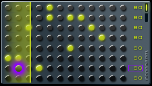

# Monome for the PSP

# What is this?
A simple sequencer for the Sony PSP, made by someone that has no idea what a sequencer is.
It simply plays sounds in a user defined pattern.

 # Controls
- X  : add / remove
- /\ : clear
- [] | O : speed up | down
- ([] | O) + Right trigger : speed up | down individualy
- Up | Right | Down | Left : move
- (Up | Down) + Right trigger : synchronize

# Screenshots
